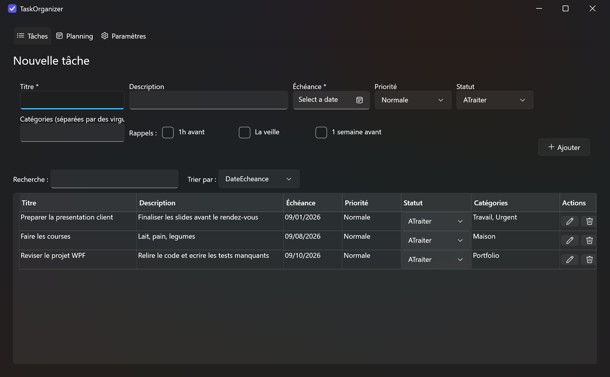
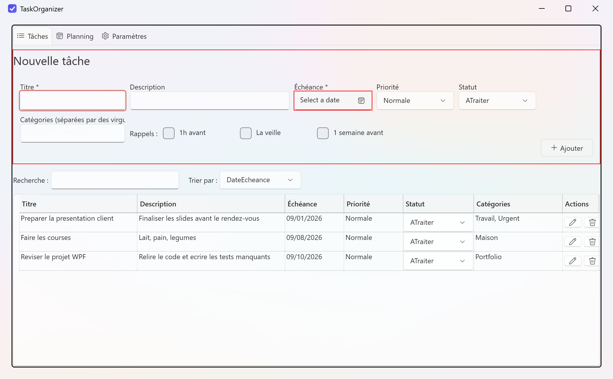
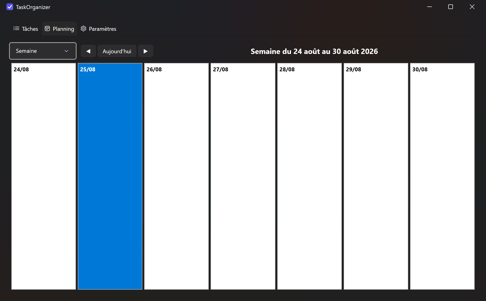
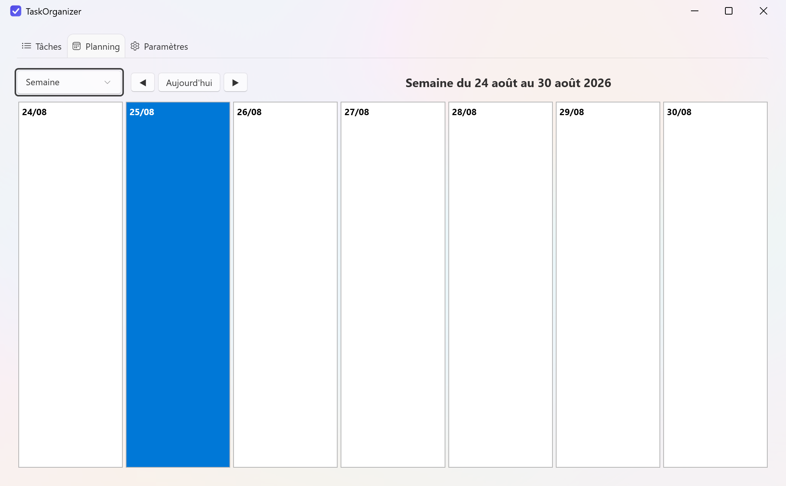
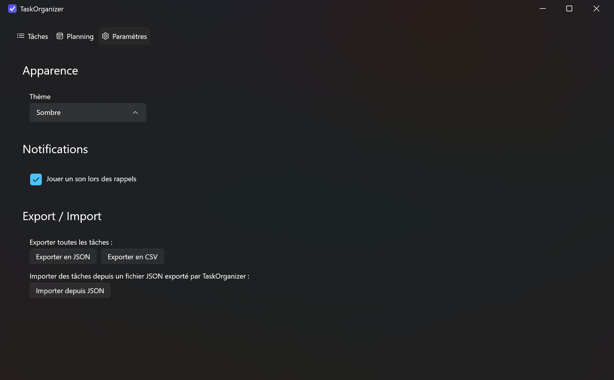
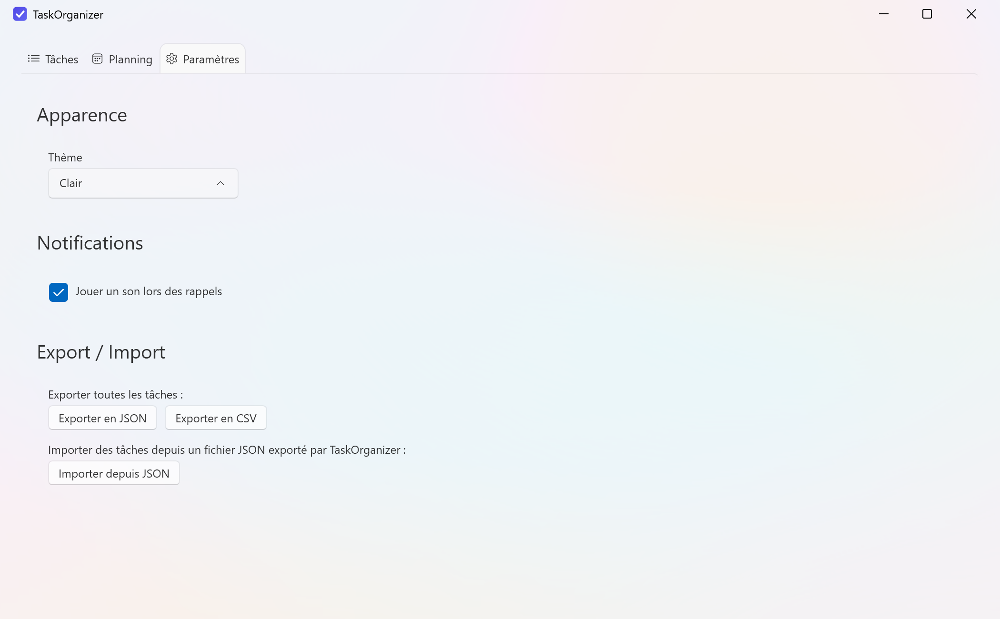

# TaskOrganizer

[](https://github.com/nicolasdossantosdev/TaskOrganizer/actions/workflows/ci.yml)

Application desktop Windows (WPF / .NET) pour organiser des tâches : création,
planification, priorisation et suivi de statut. Voir [CLAUDE.md](CLAUDE.md)
pour le contexte produit, le périmètre et les conventions du projet.

## Fonctionnalités

- **Tâches** : titre, description, échéance, priorité, statut, catégories
  multiples ; création, édition, suppression (avec confirmation), changement
  de statut inline depuis la liste, recherche texte et tri.
- **Planning** : vue calendrier Jour / Semaine / Mois / Aujourd'hui / À venir,
  replanification d'une tâche par glisser-déposer directement sur le
  calendrier.
- **Rappels & notifications** : rappels programmables par tâche (1h avant, la
  veille, 1 semaine avant), notifications toast Windows natives, résumé des
  rappels manqués au démarrage, son de notification activable/désactivable.
- **Apparence** : thème clair / sombre / système, appliqué immédiatement et
  mémorisé d'une session à l'autre.
- **Export / Import** : export de toutes les tâches en JSON ou CSV, import
  depuis un fichier JSON exporté par TaskOrganizer.

## Captures d'écran

| Liste des tâches (sombre) | Liste des tâches (clair) |
| --- | --- |
|  |  |

| Planning (sombre) | Planning (clair) |
| --- | --- |
|  |  |

| Paramètres (sombre) | Paramètres (clair) |
| --- | --- |
|  |  |

## Prérequis

- [.NET SDK 10.0](https://dotnet.microsoft.com/download) ou supérieur
- Windows (l'application utilise WPF, spécifique à Windows)
- Le outil `dotnet-ef` pour gérer les migrations (installation ci-dessous)

## Structure du projet

```
TaskOrganizer.slnx
TaskOrganizer/            Application WPF (Models, Data, Services, ViewModels, Views)
TaskOrganizer.Tests/      Tests unitaires xUnit
docs/screenshots/         Captures d'écran utilisées dans ce README
.github/workflows/        Pipeline CI GitHub Actions (build + tests)
```

## Builder le projet

```powershell
dotnet build TaskOrganizer.slnx
```

## Lancer l'application

```powershell
dotnet run --project TaskOrganizer
```

Au premier démarrage, l'application applique automatiquement les migrations
EF Core et crée la base SQLite dans
`%LOCALAPPDATA%\TaskOrganizer\taskorganizer.db`. Les préférences (thème, son
des notifications) sont stockées séparément dans
`%LOCALAPPDATA%\TaskOrganizer\parametres.json`.

Les rappels sont scrutés toutes les 30 secondes en arrière-plan et déclenchent
une notification toast native (Centre de notifications Windows). Un résumé
des rappels manqués (dus pendant que l'application était fermée) s'affiche
au démarrage s'il y en a.

## Utilisation

### Gérer les tâches

L'onglet **Tâches** regroupe le formulaire de création (titre et échéance
obligatoires, le reste optionnel) et la liste des tâches existantes.
- **Modifier** / **Supprimer** : icônes d'action dans la colonne *Actions* de
  chaque ligne (la suppression demande confirmation).
- **Changer le statut** : directement depuis le menu déroulant *Statut* de la
  ligne, sans ouvrir de fenêtre d'édition.
- **Rechercher / trier** : champ de recherche texte et menu *Trier par* au-dessus
  de la liste.
- **Catégories** : à saisir séparées par des virgules (ex. `Travail, Urgent`) ;
  une catégorie déjà utilisée est réutilisée (comparaison insensible à la casse).

### Planifier

L'onglet **Planning** affiche les tâches sur un calendrier. Le menu déroulant
en haut à gauche bascule entre les modes *Jour*, *Semaine*, *Mois*,
*Aujourd'hui* et *À venir* ; les flèches et le bouton *Aujourd'hui* naviguent
dans le temps. Glisser une tâche d'un jour à un autre met à jour son échéance.

### Rappels

Depuis le formulaire de création ou d'édition, cocher un ou plusieurs délais
(*1h avant*, *la veille*, *1 semaine avant*) programme des rappels pour cette
tâche. Une notification toast Windows s'affiche à l'heure prévue.

### Paramètres

L'onglet **Paramètres** regroupe :
- **Apparence** : choix du thème (*Système* suit le thème Windows, *Clair*,
  *Sombre*), appliqué immédiatement.
- **Notifications** : activer/désactiver le son joué lors d'un rappel.
- **Export / Import** : exporter toutes les tâches en JSON ou CSV (boîte de
  dialogue *Enregistrer sous*), ou importer des tâches depuis un fichier JSON
  précédemment exporté par TaskOrganizer (les catégories manquantes sont
  recréées automatiquement).

## Lancer les tests

```powershell
dotnet test TaskOrganizer.slnx
```

La suite couvre les Services (logique métier), les Repositories (persistance
EF Core/SQLite) et les ViewModels (validation, commandes), avec des fakes pour
isoler chaque couche.

## Intégration continue

Chaque push et pull request vers `master` déclenche la pipeline GitHub Actions
définie dans [`.github/workflows/ci.yml`](.github/workflows/ci.yml) : build de
la solution puis exécution de la suite de tests sur `windows-latest` (WPF ne
peut être compilé/testé que sous Windows).

## Gérer les migrations EF Core

Installer l'outil `dotnet-ef` (une seule fois) :

```powershell
dotnet tool install --global dotnet-ef
```

Ajouter une nouvelle migration après une modification du modèle
(`TaskOrganizer/Models`) :

```powershell
dotnet ef migrations add NomDeLaMigration --project TaskOrganizer --startup-project TaskOrganizer -o Data/Migrations
```

Les migrations sont appliquées automatiquement au démarrage de
l'application ; il n'est pas nécessaire d'exécuter `dotnet ef database
update` manuellement en développement.
